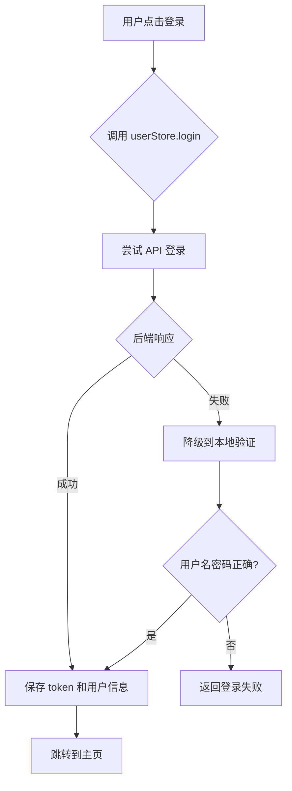

# 🔌 Pinia 连接后端 API 使用说明

## ✅ 已完成的功能

### 1️⃣ **智能登录系统**
- ✅ 支持后端 API 登录验证
- ✅ 支持本地降级验证(后端挂了也能演示)
- ✅ 自动保存 token 和用户信息
- ✅ 完美适配 Spring Boot 和 SSM 两种后端

---

## 🎯 切换后端只需改一个地方!

### 📁 文件位置: `src/utils/request.ts`

#### 方式1: 使用 Spring Boot 后端
```typescript
// Spring Boot 版本后端（推荐）
const baseURL = 'http://localhost:80'
const isSpringBoot = true  // Spring Boot 版本

// SSM 版本后端
//const baseURL = 'http://localhost:8080/springproduct'
//const isSpringBoot = false  // SSM 版本
```

#### 方式2: 使用 SSM 后端
```typescript
// Spring Boot 版本后端（推荐）
//const baseURL = 'http://localhost:80'
//const isSpringBoot = true  // Spring Boot 版本

// SSM 版本后端
const baseURL = 'http://localhost:8080/springproduct'
const isSpringBoot = false  // SSM 版本
```

**就这么简单!** 🎉 其他地方完全不用改!

---

## 🚀 登录流程说明

### 用户登录时发生了什么?



### 具体步骤:

1. **用户输入账号密码** → 点击登录
2. **Pinia store 发起 API 请求** → `/dev-api/yjnb/system/login`
3. **request.ts 自动处理**:
   - 添加 `Authorization` 头(如果有 token)
   - 根据 `isSpringBoot` 自动调整路径
   - Spring Boot: `/dev-api/yjnb/system/login`
   - SSM: `/api/yjnb/system/login`
4. **后端验证成功** → 返回 token 和用户信息
5. **Pinia 保存数据**:
   - 存到 `state` 中(响应式)
   - 存到 `localStorage`(持久化)
6. **跳转到主页**

---

## 📊 后端 API 接口规范

### 登录接口

**Spring Boot 版本:**
```
POST http://localhost:80/dev-api/yjnb/system/login
```

**SSM 版本:**
```
POST http://localhost:8080/springproduct/api/yjnb/system/login
```

**请求体:**
```json
{
  "username": "admin",
  "password": "admin123"
}
```

**成功响应:**
```json
{
  "code": 200,
  "msg": "登录成功",
  "data": {
    "username": "admin",
    "token": "eyJhbGciOiJIUzI1NiIsInR5cCI6IkpXVCJ9...",
    "role": "管理员"
  }
}
```

**失败响应:**
```json
{
  "code": 401,
  "msg": "用户名或密码错误"
}
```

---

### 登出接口(可选)

**Spring Boot 版本:**
```
POST http://localhost:80/dev-api/yjnb/system/logout
```

**SSM 版本:**
```
POST http://localhost:8080/springproduct/api/yjnb/system/logout
```

**请求体:**
```json
{
  "token": "eyJhbGciOiJIUzI1NiIsInR5cCI6IkpXVCJ9..."
}
```

---

## 🔐 Token 自动管理

### Token 在哪里?
- **存储位置**: `localStorage.getItem('token')`
- **自动添加**: `request.ts` 拦截器会自动在所有请求中加上 `Authorization` 头

### Token 的生命周期:
1. **登录成功** → 保存 token
2. **后续请求** → 自动携带 token
3. **退出登录** → 清除 token
4. **页面刷新** → 从 localStorage 恢复

---

## 🛠️ 三种登录模式

### 模式1: 智能登录(推荐) ⭐
```typescript
const result = await userStore.login(username, password)
```
- 优先尝试 API 登录
- API 失败时降级到本地验证
- **适合**: 所有场景

### 模式2: 强制 API 登录
```typescript
const result = await userStore.loginWithAPI(username, password)
```
- 只使用后端 API 验证
- 失败就返回失败,不降级
- **适合**: 生产环境

### 模式3: 强制本地登录
```typescript
const result = await userStore.loginLocal(username, password)
```
- 只使用本地验证(admin/admin123)
- 不调用后端 API
- **适合**: 演示或测试

---

## 📝 使用示例

### 示例1: 登录页面
```vue
<script setup>
import { ref } from 'vue'
import { useRouter } from 'vue-router'
import { useUserStore } from './store/user'

const router = useRouter()
const userStore = useUserStore()

const username = ref('')
const password = ref('')

const login = async () => {
  // 调用智能登录
  const result = await userStore.login(username.value, password.value)
  
  if (result.success) {
    router.push('/main')
  } else {
    alert(result.message)
  }
}
</script>
```

### 示例2: 导航栏显示用户信息
```vue
<template>
  <div>
    <span>{{ userStore.userInfo }}</span>
    <button @click="handleLogout">退出</button>
  </div>
</template>

<script setup>
import { useUserStore } from '@/store/user'

const userStore = useUserStore()

const handleLogout = async () => {
  await userStore.logout()
  router.push('/login')
}
</script>
```

### 示例3: 页面加载时检查登录状态
```vue
<script setup>
import { onMounted } from 'vue'
import { useUserStore } from '@/store/user'

const userStore = useUserStore()

onMounted(() => {
  userStore.checkLogin()  // 从 localStorage 恢复登录状态
})
</script>
```

---

## 🔍 调试技巧

### 1. 查看控制台日志
登录时会打印详细日志:
```
✅ API登录成功: admin
🔐 已添加 token 到请求头
🚀 最终请求URL: http://localhost:80/dev-api/yjnb/system/login
```

### 2. 查看 localStorage
打开浏览器控制台 → Application → Local Storage:
- `user`: 用户名
- `token`: 登录令牌
- `role`: 用户角色

### 3. 查看网络请求
打开浏览器控制台 → Network:
- 查看 `/system/login` 请求
- 检查请求头是否有 `Authorization`
- 查看响应数据

---

## ❓ 常见问题

### Q1: 后端接口返回 404?
**A**: 检查 `request.ts` 中的配置:
- Spring Boot: `baseURL = 'http://localhost:80'`, `isSpringBoot = true`
- SSM: `baseURL = 'http://localhost:8080/springproduct'`, `isSpringBoot = false`

### Q2: 后端没启动怎么办?
**A**: 使用智能登录模式,会自动降级到本地验证:
- 账号: `admin`
- 密码: `admin123`

### Q3: Token 过期怎么办?
**A**: 
1. 后端返回 401 时,前端自动清除登录状态
2. 可以在 `request.ts` 响应拦截器中处理:
```typescript
response.interceptors.response.use(
  response => response.data,
  error => {
    if (error.response?.status === 401) {
      // 清除登录状态,跳转到登录页
      localStorage.clear()
      window.location.href = '/login'
    }
    return Promise.reject(error)
  }
)
```

### Q4: 想修改登录接口路径?
**A**: 修改 `src/store/user.ts` 中的接口地址:
```typescript
const res = await request.post('/dev-api/yjnb/system/login', {
  username: user,
  password: pass
})
```

---

## 🎉 总结

✅ **切换后端**: 只需修改 `request.ts` 两行配置  
✅ **智能降级**: API 失败自动使用本地验证  
✅ **Token 管理**: 自动添加到所有请求  
✅ **持久化**: 自动保存到 localStorage  
✅ **响应式**: 用户信息实时更新  

**现在您可以无缝切换 Spring Boot 和 SSM 后端了!** 🚀

